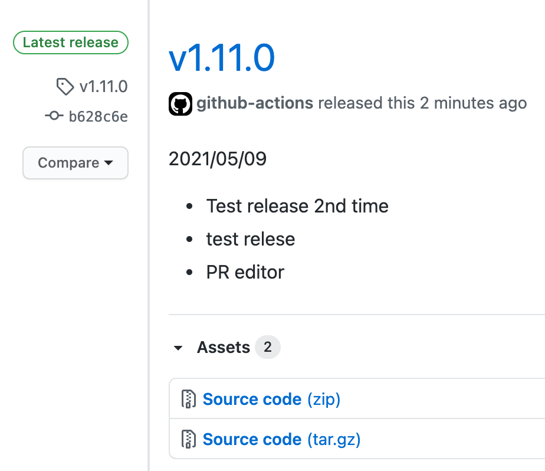

# changelog-generator

This github action fetches titles of pull requests between latest release and branch's HEAD creates changelog from them.

It can look something like this:



## Inputs

| Input  |                               Description |               Example |                                                    Default | Required |
| :----- | ----------------------------------------: | --------------------: | ---------------------------------------------------------: | -------: |
| token  |              github personal access token |             `ghe_xyz` |                                    **NO DEFAULT PROVIDED** |      yes |
| branch |               base branch of pull request |                `main` |                                repositories default branch |       no |
| title  |                           changelog title |           `Changelog` |                                          date `YYYY/MM/DD` |       no |
| prefix | prefix of pull request title in changelog |                   `*` |                                                        `-` |       no |
| owner  |       owner or organizatoin of repository |          `dragonraid` | `GITHUB_REPOSITORY` environment variable (part before `/`) |       no |
| repo   |                                repository | `chnagelog-generator` |  `GITHUB_REPOSITORY` environment variable (part after `/`) |       no |

## Output

| Output    |       Description |
| :-------- | ----------------: |
| changelog | text of changelog |

Text of changelog can also be accessed in subsequent steps via `CHANGELOG` environment variable.

## Example

This example together with other useful github actions creates new release with pull requests titles as release's body.

```yaml
name: release

on:
  push:
    branches:
      - main

jobs:
  release:
    runs-on: ubuntu-20.04
    steps:
      - name: Checkout repository
        uses: actions/checkout@v2

      - name: Create changelog
        id: changelog
        uses: dragonraid/changelog-generator@v0.1.0
        with:
          github_token: ${{ secrets.GITHUB_TOKEN }}

      - name: Bump tag
        id: tag
        uses: mathieudutour/github-tag-action@v5.5
        with:
          github_token: ${{ secrets.GITHUB_TOKEN }}
          release_branches: main
          default_bump: minor

      - name: Create github release
        uses: actions/github-script@v4
        with:
          github-token: ${{ secrets.GITHUB_TOKEN }}
          script: |
            github.repos.createRelease({
                owner: context.repo.owner,
                repo: context.repo.repo,
                tag_name: `${{ steps.tag.outputs.new_tag }}`,
                name: `${{ steps.tag.outputs.new_tag }}`,
                body: `${{ steps.changelog.outputs.changelog }}`,
            });

```
